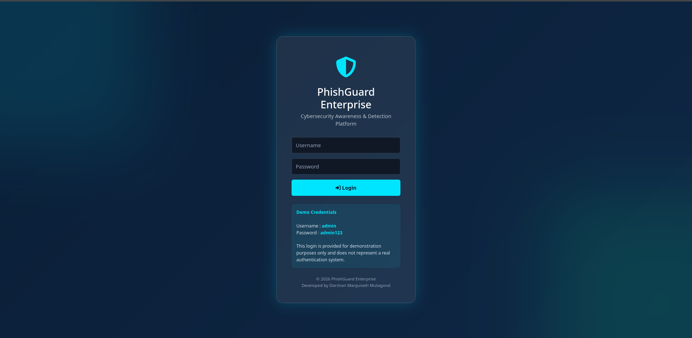
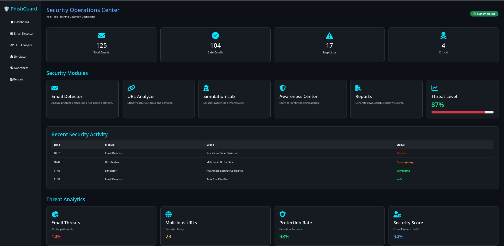
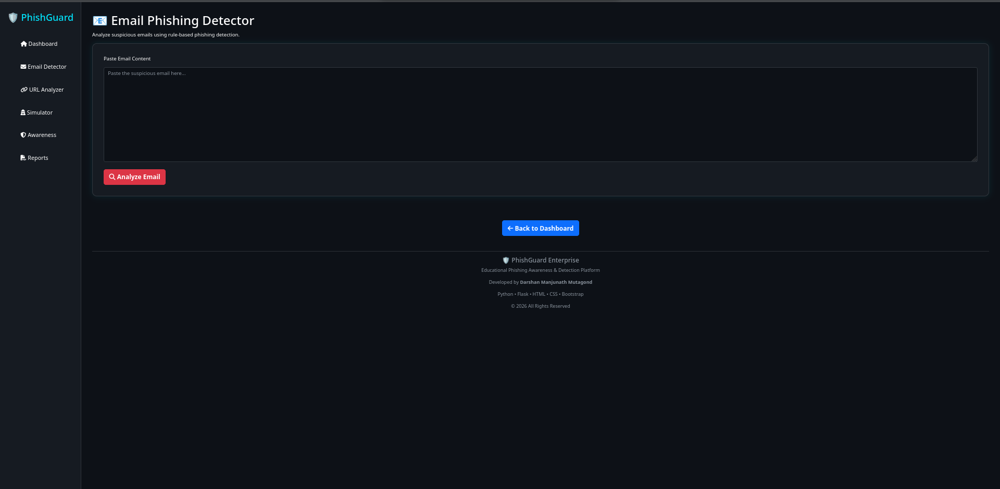
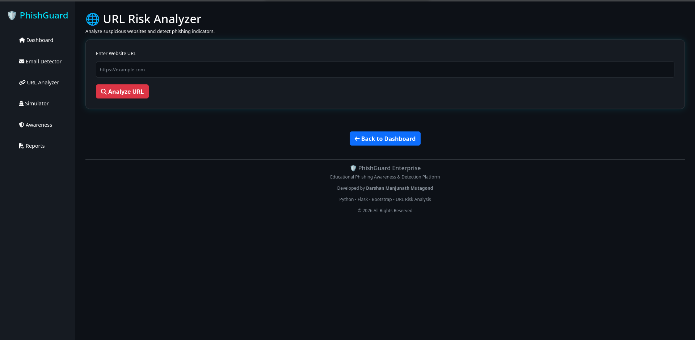
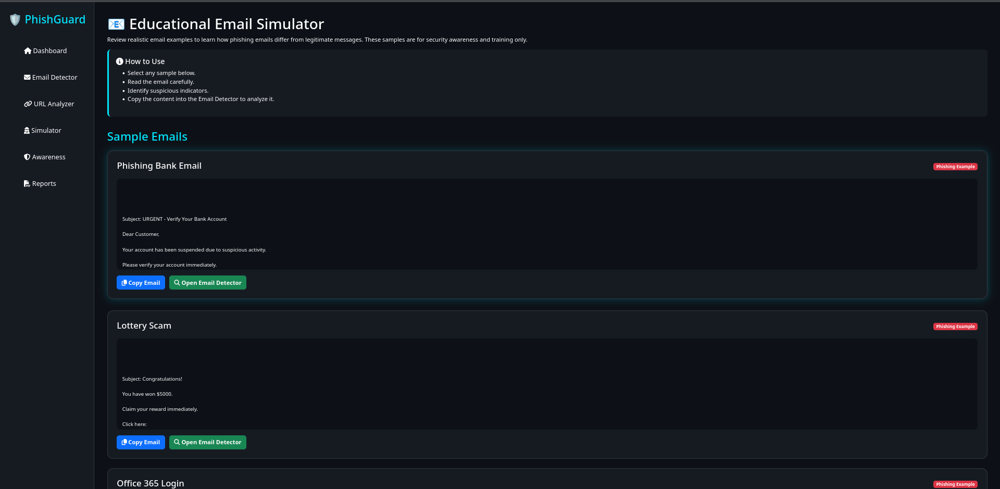
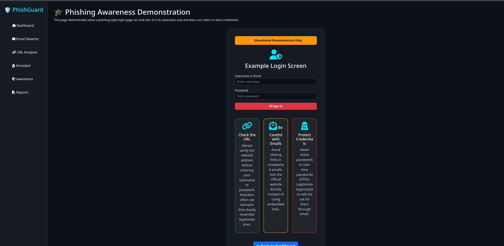
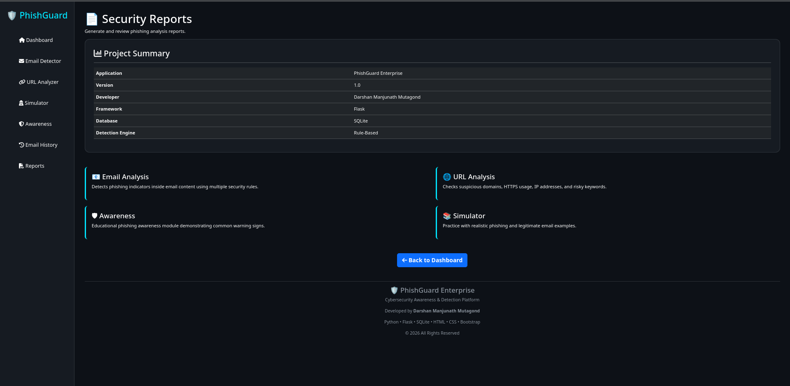

# 🛡️ PhishGuard

A Flask-based cybersecurity project that detects phishing emails and suspicious URLs while improving cybersecurity awareness.

---

## 🚀 Features

- 📧 Email Phishing Detection
- 🌐 URL Analyzer
- 🛡️ Phishing Awareness Module
- 📚 Email Simulator
- 📊 Dashboard
- 💾 SQLite Database
- 📜 Email History
- 📄 Security Report

---

## 🛠 Technologies Used

- Python
- Flask
- SQLite
- HTML5
- CSS3
- Bootstrap 5
- JavaScript

---

## 📂 Project Structure

```
PhishGuard/
│
├── app.py
├── detector/
├── database/
├── simulator/
├── templates/
├── static/
└── requirements.txt
```

---

## ⚙️ Installation

```bash
git clone https://github.com/123DarshanM/PhishGuard.git

cd PhishGuard

pip install --break-system-packages -r requirements.txt

python app.py

xdg-open http://127.0.0.1:5000/

```

---

## 📚 Educational Purpose

This project was developed for educational purposes to understand phishing detection techniques and cybersecurity awareness.

---


## Screenshots

### Login



### Dashboard



### Email Detector



### URL Analyzer



### Simulator



### Awareness



### Report



## 👨‍💻 Developer

**Darshan Manjunath Mutagond**
